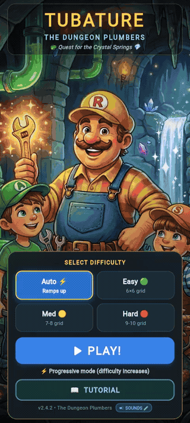

# 🚰 Tubature: The Dungeon Plumber 🐉💎

> ### 🎮 **PLAY LIVE NOW**: [https://palladius.github.io/tubature/](https://palladius.github.io/tubature/) 🚀

[]()
[]()
[]()

**Tubature** (*FlowConnect*) is a vibrant, enchanting fantasy pipe-puzzle game built with **Flutter & Riverpod**. Starring **Riccardo the Dungeon Plumber** (wearing his signature yellow **"R"** cap) and his cute baby emerald dragon companion, you rotate magical conduits on an ancient dungeon grid to let crystal water rush through **every single tile** on the board!

### 🎬 Gameplay Demo

<div align="center">
  
  <br/>
  <em>🤖 AI solver plays an Easy 6×6 level — 62 clicks, 36/36 tiles connected! 🏆</em>
</div>

> See [`docs/demos/`](docs/demos/) for more recordings.

---

## 🌟 Game Features

- 🎮 **Live Web Deployment**: Zero installation, play instantly on any phone, tablet, or browser: **[https://palladius.github.io/tubature/](https://palladius.github.io/tubature/)**
- 🧙‍♂️ **Riccardo the Dungeon Plumber**: Explore ancient D&D castles, crystal grottos, and treasure vaults with your glowing magical golden wrench.
- 🌊 **Liquid Flow & Staggered Water Animation**: Watch water rush dynamically from the source along newly connected pipes in real time.
- 🎵 **Procedural Audio Synthesis**: Built-in sound effects (ratchet rotation clicks, bubbling fluid rushing, victory fanfares) synthesized on Web Audio API with zero external audio assets.
- 📱 **Mobile-First & Kid-Friendly**: Large, finger-friendly touch targets (56dp+), locked 1:1 crisp scaling on mobile, with responsive glassmorphic cards on tablets and desktop.
- 🐉 **Medieval Fantasy D&D Themes**:
  - 🐉 **Dragon & Gems** (Emerald green)
  - 🧙 **Wizard & Alchemy Lab** (Royal purple)
  - 💎 **Crystal Caves** (Luminous cyan turquoise)
  - 🪙 **Dungeon Treasure Vault** (Radiant amber gold)
  - 🏛️ **Dragon Aqueduct** (Deep aquatic teal)
- 🏆 **Dynamic Game Modes**:
  - ⚡ **Auto / Progressive**: Starts easy and automatically ramps up grid size as you solve levels.
  - 🟢 **Easy**: 6×6 grid
  - 🟡 **Medium**: 7×7 / 8×8 grid
  - 🔴 **Hard**: 9×9 / 10×10 grid
  - 📖 **Tutorial**: 10 progressive handcrafted learning levels.

---

## 🛠️ Quick Start

```bash
# Clone the repository
git clone git@github.com:palladius/tubature.git
cd tubature

# Run tests
just test
# or
flutter test

# Run locally in browser
just serve
# opens http://localhost:8765
```

---

## 🏗️ Tech Stack

- **Framework**: Flutter (cross-platform Web, Android, iOS)
- **Language**: Dart (pure game logic, decoupled from UI)
- **State Management**: Flutter Riverpod
- **Audio**: Procedural Web Audio API synthesizer (`dart:js_interop`)

---

## 📜 Version & Changelog

Current version: **v2.2.0** — see [CHANGELOG.md](CHANGELOG.md) for full history.
