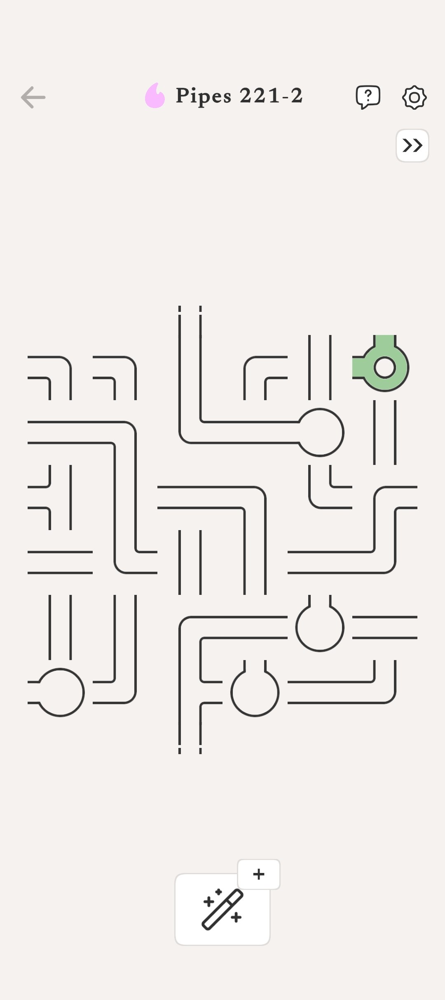
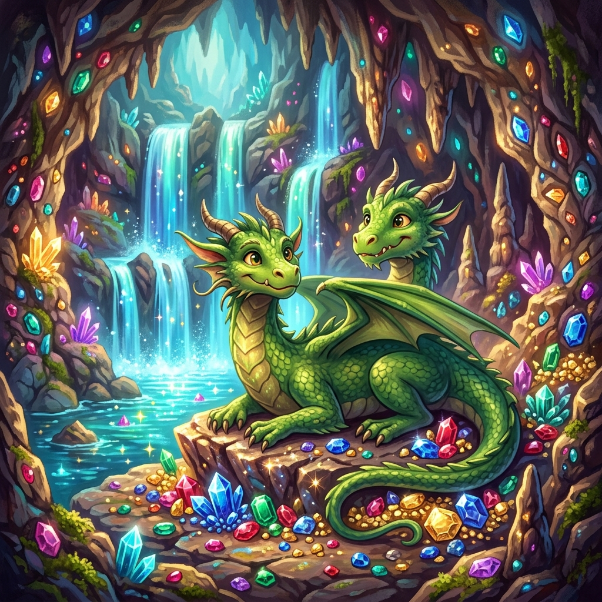
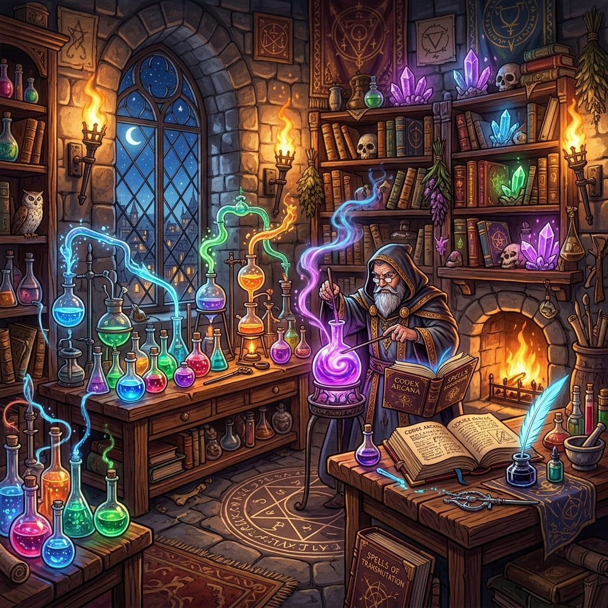
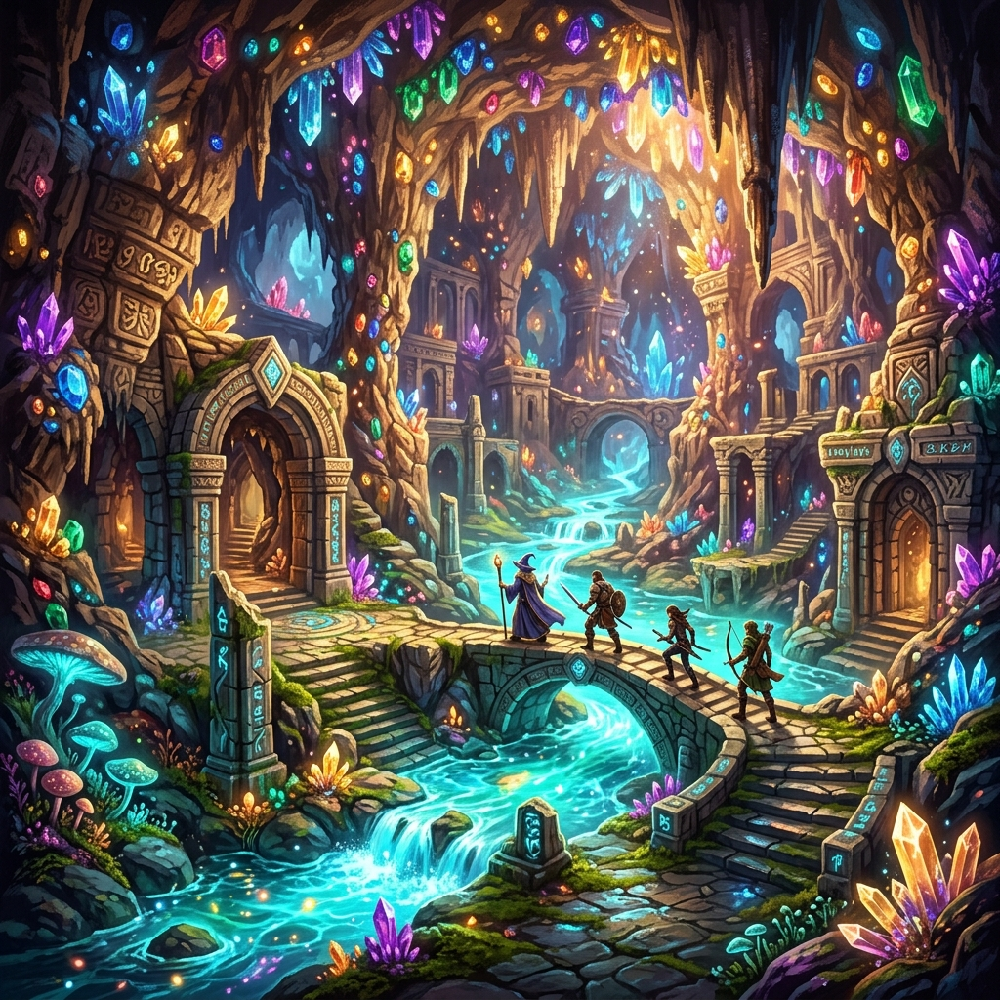

# No More Ad-Pocalypse: How I Built 'Tubature', a Free Flutter Dungeon Pipe Puzzle for My Kids with Antigravity 🐉🚰

> 🎮 **Play Live Now in Your Browser**: [https://palladius.github.io/tubature/](https://palladius.github.io/tubature/) 🚀  
> 📦 **GitHub Repository**: [https://github.com/palladius/tubature](https://github.com/palladius/tubature)

<div align="center">
  <video src="media/20260824-game-v2.4.2-easy-mobile.mp4" controls autoplay loop muted width="340" style="border-radius: 12px; box-shadow: 0 8px 24px rgba(0,0,0,0.3);"></video>
  <br/>
  <em>🎬 Gameplay Demo: Riccardo the Dungeon Plumber solving an Easy 6×6 board (36/36 tiles connected)!</em>
</div>

---

## ☕ The Hook: A Sofa, Two Kids, and the Ad-Pocalypse

Picture this: It is a rainy Saturday afternoon at home. I am sitting on the sofa sipping a hot double espresso (☕🇮🇹), hoping for fifteen minutes of peaceful downtime. 

Next to me, my kids are locked in an all-out civil war over a single Android smartphone. The prize? A commercial pipe-puzzle game where you rotate tiles on a grid to guide water from point A to point B. They loved the puzzles. But modern mobile app stores have turned casual gaming into a psychological war zone.

Every single 20-second puzzle was immediately interrupted by a 30-second unskippable video ad for fake mobile games about pulling pins. When the ads finally stopped, aggressive modal dialogs popped up begging for in-app purchases: *"Out of Plumber Energy! Buy 50 Magic Gems for $4.99 or wait 4 hours to rotate another pipe!"*

My kids were frustrated, arguing over whose turn it was to watch an ad. I was staring in disbelief at the monetization dark patterns. 

I am Riccardo: an SRE and BashOps veteran who loves clean shell scripts, elegant Ruby gems, and building things that respect human attention. I spent two decades keeping production systems running, and if there is one thing I cannot tolerate, it is software designed to manufacture user misery.

I looked at my kids, slammed my espresso cup down, and declared:  
**"Basta! Ullalla! Why are we suffering through ad-pocalypse when we can build our own ad-free, magical dungeon plumber game from scratch?"**

*Et voilà!* Over a few evening pair-programming sessions with **Google Antigravity**, we built **Tubature: The Dungeon Plumber** (🚰🐉💎). It is an open-source, kid-friendly fantasy puzzle game built with **Flutter**, **Riverpod**, and pure **Dart**—playable seamlessly on Android, iOS, tablet, and desktop browser!

<div align="center">
  
  <br/>
  <em>Tap, rotate, and watch the crystal dungeon water flood through conduits!</em>
</div>

---

## 🗺️ Early Roadmap: What We Will Cover

In this article, we will see how to:
1. **Model Pure-Dart Puzzle Logic**: Designing a randomized DFS spanning-tree generator and graph solver that guarantees 100% solvable levels with 90%+ unit test coverage.
2. **Build a Kid-Friendly, Cross-Platform UI**: Crafting 56dp+ touch targets on mobile alongside crisp desktop mouse and keyboard ergonomics.
3. **Synthesize Procedural Audio with Zero Assets**: Using the browser Web Audio API via `dart:js_interop` for ratchet clicks, bubbling fluid rushes, and victory fanfares without shipping bulky audio files.
4. **Deploy as a Static SPA on GitHub Pages for $0**: Compiling Flutter to static WebAssembly/JS so anyone on Earth can play instantly with zero server infrastructure.
5. **Supercharge Game Development with Antigravity**: Pairing with AI agents to turn game design ideas into rock-solid production code in record time.

---

## 🐉 What on Earth is Tubature?

In Italian, *"Tubature"* means plumbing or piping. But we wanted something infinitely more fun than fixing kitchen sinks. 

We created **Riccardo the Dungeon Plumber**—a cheerful pixel hero wearing a bright yellow **"R"** cap, accompanied by a cute baby emerald dragon! Together, you explore ancient D&D castles, alchemy laboratories, and crystal treasure vaults. 

```
 ┌───────────────────────────────────────────────────────────┐
 │                   THE TUBATURE ARCHITECTURE               │
 └─────────────────────────────┬─────────────────────────────┘
                               │
       ┌───────────────────────┼───────────────────────┐
       ▼                       ▼                       ▼
 [Pure Dart Core]       [Riverpod State]       [Multi-Platform UI]
 • DFS Spanning Tree    • GameNotifier         • Mobile: 56dp+ Tap Grid
 • WinChecker           • Difficulty Engine    • Desktop: Mouse/Keys
 • 100% Solvable Levels • Audio Routing        • Web: Static HTML5/JS
```

### The Big Twist: The Spanning Tree Win Condition

In traditional pipe games, you connect a **Source** tile to a **Sink** tile, and all the extra tiles are just useless junk. 

Tubature v2.0 changes the rules entirely: **There is no Sink!**  
The water originates from the Source creature, and victory only occurs when **every single tile on the grid** is connected and filled with rushing crystal water.

<div align="center">
  
  
  
  <br/>
  <em>Original Italian design mockups: Every pipe must connect back to the creature source.</em>
</div>

Here is what the pure Dart `WinChecker` looks like:

```dart
class WinChecker {
  /// Check if ALL non-empty tiles on the grid are connected to the source.
  /// Win condition: Every single tile must be reachable through matching openings.
  static bool checkWin(Grid grid) {
    Position? sourcePos;
    int totalTiles = 0;

    for (int r = 0; r < grid.rows; r++) {
      for (int c = 0; c < grid.cols; c++) {
        final tile = grid.tiles[r][c];
        if (tile.type != TileType.empty) {
          totalTiles++;
          if (tile.type == TileType.source) {
            sourcePos = Position(r, c);
          }
        }
      }
    }

    if (sourcePos == null) return false;

    // Graph traversal from source:
    final connected = PathFinder.findConnected(grid, sourcePos);
    return connected.length == totalTiles;
  }
}
```

*Wham!* Because all game logic is pure Dart with zero Flutter UI dependencies, our entire test suite (`just test`) runs in under two seconds. Zero flakiness, 100% mathematical certainty.

---

## 🎨 Kid-Friendly Ergonomics: From Pixel Phones to Desktops

Designing for my kids taught me a lot about touchscreen ergonomics:
- **Large Touch Targets (56dp+)**: Young children do not click with 1-pixel precision; they tap vigorously with thumbs. Every tile is sized for instant, forgiving interaction.
- **Dynamic Color Flooding**: As soon as a conduit connects to the source, color floods through the pipe dynamically, giving immediate visual feedback.
- **Cross-Platform Parity**: On a Pixel 10 phone, it feels like a native mobile app. On a laptop or Mac, you get responsive glassmorphic cards with keyboard shortcuts (`R` to rotate, `Space` for hint, arrow keys to navigate).

<div align="center">
  
  
  
  <br/>
  <em>Custom Fantasy D&D Themes: Emerald Dragon Lair 🐉, Wizard Alchemy Lab 🧙, and Crystal Caves 💎!</em>
</div>

---

## 🔊 Zero-Asset Procedural Audio: The Web Audio API Trick

Shipping mobile and web games usually means bundling megabytes of `.wav` and `.mp3` sound files. That slows down initial page loads and causes audio latency on web browsers.

Instead, we built a **real-time procedural audio synthesizer** directly on the HTML5 Web Audio API using `dart:js_interop`!

When a tile rotates, an oscillator generates a quick triangle-wave ratchet click. When water floods through a conduit, we trigger staggered sine-wave frequency ramps that simulate bubbling fluid rushing through ancient stone pipes:

```javascript
// Web Audio procedural water rush synthesizer in web/index.html
water: function(chain) {
  this.init();
  if (!this.ctx) return;
  var t = this.ctx.currentTime;
  var count = Math.min(Math.max(chain, 1), 6);
  for (var i = 0; i < count; i++) {
    var delay = i * 0.07;
    var osc = this.ctx.createOscillator();
    var gain = this.ctx.createGain();
    var baseFreq = 400 + Math.random() * 200 + (i * 80);
    osc.type = 'sine';
    osc.frequency.setValueAtTime(baseFreq, t + delay);
    osc.frequency.exponentialRampToValueAtTime(baseFreq * 1.6, t + delay + 0.09);
    gain.gain.setValueAtTime(0.001, t + delay);
    gain.gain.linearRampToValueAtTime(0.18, t + delay + 0.02);
    gain.gain.exponentialRampToValueAtTime(0.001, t + delay + 0.12);
    osc.connect(gain);
    gain.connect(this.ctx.destination);
    osc.start(t + delay);
    osc.stop(t + delay + 0.13);
  }
}
```

*TA-DAH!* The entire audio engine weighs **zero bytes** in downloaded media assets, starts instantly, and never suffers from mobile audio unlock latency.

---

## 🚀 The $0 Infrastructure: Compiling to a Static SPA on GitHub Pages

Here is the best part: As an SRE, I hate maintaining servers for side projects. I do not want Docker containers crashing at 3 AM or cloud bills running up just because a game went viral.

Flutter compiles straight to a static **Single Page Application (SPA)** with WebAssembly and JavaScript. That means the entire game can be hosted 100% free on **GitHub Pages**!

With a simple `justfile` recipe, deploying a new release takes one command:

```bash
# In the repository root:
just deploy
```

Under the hood, `just deploy` builds the optimized Flutter web bundle with the appropriate base href and pushes it directly to the `gh-pages` branch:

```just
# Deploy to GitHub Pages (https://palladius.github.io/tubature/)
deploy:
    flutter build web --base-href '/tubature/'
    cp -r build/web /tmp/tubature_deploy
    git checkout gh-pages
    git rm -rf . --quiet 2>/dev/null || true
    cp -r /tmp/tubature_deploy/* .
    git add -A
    git commit -m 'deploy: update GitHub Pages'
    git push github gh-pages
    git checkout main
    rm -rf /tmp/tubature_deploy
    @echo "✅ Deployed! Visit: https://palladius.github.io/tubature/"
```

Zero servers. Zero monthly bills. Infinite scale.

---

## 🛠️ War Stories: Lessons Learned the Hard Way

Building Tubature was a blast, but we hit our fair share of interesting hurdles:

1. **The Spanning Tree Shuffle Gotcha**: If you generate random tiles on a grid, only 0.01% of boards will be solvable. We solved this by generating a full DFS spanning tree starting from the source, guaranteeing connectivity, and then applying random rotations.
2. **Mobile Viewport 1:1 Scaling**: On mobile browsers, default viewport scaling can cause Flutter's canvas to zoom in awkwardly when double-tapped. Adding `touch-action: manipulation` and locking viewport scaling in `web/index.html` gave us rock-solid mobile feel.
3. **The `--base-href` Trap**: When developing locally on `localhost:8765`, Flutter expects `/`. On GitHub Pages, it expects `/tubature/`. Encapsulating this in our `justfile` eliminated 100% of asset-path breakage.

---

## 🌟 Riccardo's Favorites (The Low-Hanging Fruit)

- **Pure Dart Game Logic**: Keeping all rules in `lib/logic/` with zero UI dependencies makes testing a joy.
- **Procedural Sound FX**: Synthesizing audio via Web Audio API saves bandwidth and eliminates asset licensing headaches.
- **Riverpod State Cleanliness**: Clean separation of state (`GameNotifier`) and presentation widgets.

---

## 🤝 Behind the Scenes & Collaborators

A massive shoutout to:
- **My Kids**: Chief Playtesters, bug finders, and enthusiastic designers who demanded the emerald dragon and wizard lab themes!
- **Google Antigravity Team**: For creating the ultimate AI pair-programming environment that turned game ideas into working code in record time.

---

## 🎯 Now, Go Build Your Own! 🚀

Why let predatory mobile games hijack your family's screen time? You have the tools, the framework, and AI superpowers at your fingertips.

1. 🎮 **Play Tubature Live**: [https://palladius.github.io/tubature/](https://palladius.github.io/tubature/)
2. 📦 **Grab the Source Code**: [https://github.com/palladius/tubature](https://github.com/palladius/tubature)
3. 🤖 **Call to Action**: **Use Antigravity to create cross-platform Flutter games like I did!**
4. 🇮🇹 **Connect**: Check out my articles on [ricc.rocks](https://ricc.rocks/) or connect with me on [LinkedIn](https://www.linkedin.com/in/riccardocarlesso/)!
